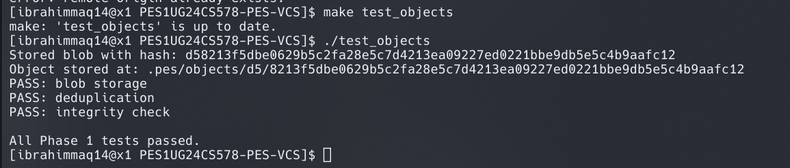
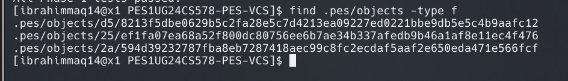
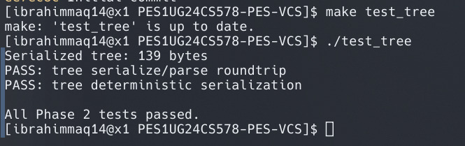
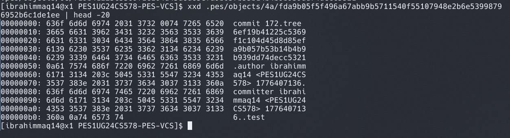
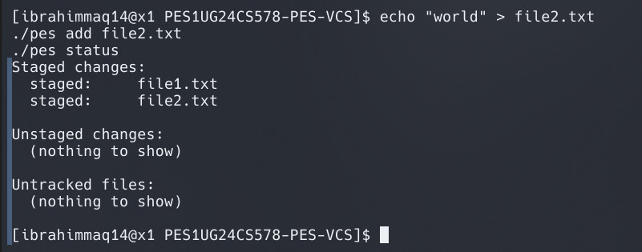
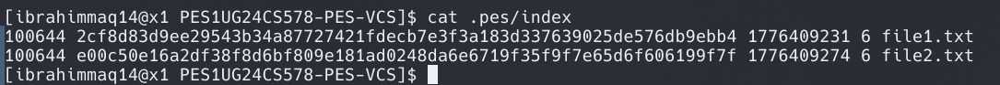
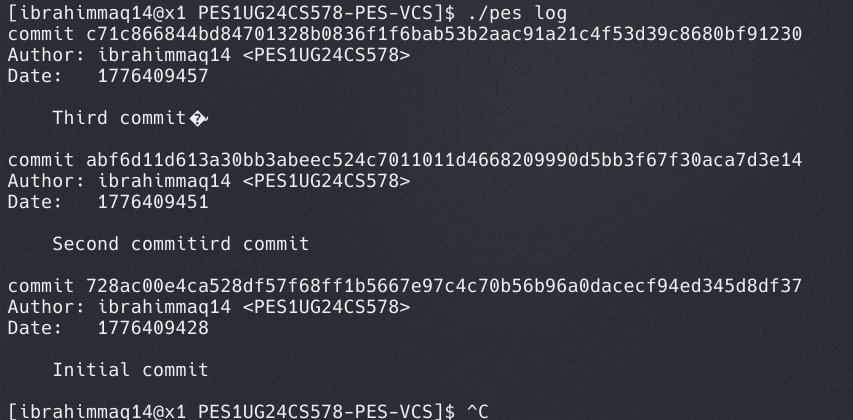
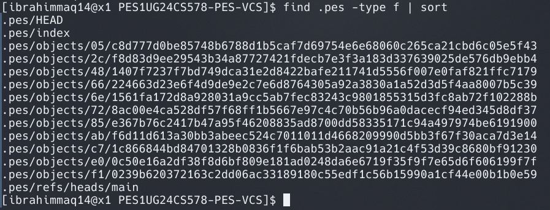
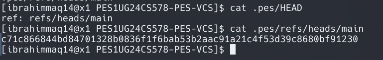

# PES Version Control System (PES-VCS)

## Phase 1: Object Storage

### Screenshot 1A

### Screenshot 1B

---

## Phase 2: Tree Objects

### Screenshot 2A

### Screenshot 2B

---

## Phase 3: Index (Staging Area)

### Screenshot 3A

### Screenshot 3B

---

## Phase 4: Commits and History

### Screenshot 4A

### Screenshot 4B

### Screenshot 4C

---

## Phase 5: Analysis Questions

### Q5.1

A branch is a file storing a commit hash. To implement checkout:

* Update HEAD to point to the branch
* Read the commit tree of that branch
* Replace working directory files with tree contents

Complexity arises due to handling uncommitted changes and file conflicts.

---

### Q5.2

Compare working directory files with index entries:

* If a file differs from the index and also differs in the target branch → conflict
* Reject checkout if mismatch exists

---

### Q5.3

Detached HEAD stores a commit directly:

* New commits are not attached to any branch
* Can recover using the commit hash and creating a new branch

---

## Phase 6: Garbage Collection

### Q6.1

Use graph traversal (DFS/BFS):

* Start from all branch heads
* Mark reachable objects
* Delete unmarked objects

Use a hash set to track visited objects.

---

### Q6.2

Garbage collection during commit can delete objects being written:

* Causes race conditions between commit and GC

Git avoids this using:

* Lock files
* Reference tracking
* Delayed garbage collection

---

## Conclusion

Successfully implemented a Git-like version control system with object storage, tree structures, indexing, and commit history management.
